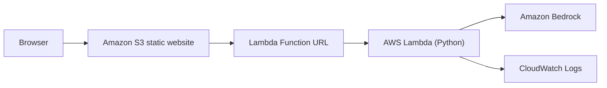
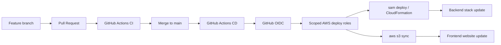

# AWS Cloud AI Web

AWS Cloud AI Web is a small serverless portfolio project that exposes a public question-and-answer interface backed by AWS. A user opens a static website, submits one question, and receives a real answer generated by Amazon Bedrock through an AWS Lambda backend.

The project is intentionally narrow in scope. It demonstrates a complete path from browser to managed LLM, infrastructure as code with AWS SAM, and a GitHub Actions delivery pipeline that uses GitHub OIDC instead of long-lived AWS keys.

## Live Demo

- Public website: `http://aws-cloud-ai-web-herrerogusano-frontend.s3-website-eu-west-1.amazonaws.com`
- Backend endpoint: Lambda Function URL behind the deployed frontend
- Scope note: this is an educational public endpoint with no authentication
- Hosting note: the public website is HTTP because Amazon S3 static website hosting does not provide HTTPS directly

Portfolio demo material:

- [Architecture guide](docs/architecture.md)
- [Demo script](docs/demo-script.md)
- [Interview notes](docs/interview-notes.md)

## Main Features

- Static frontend built with plain HTML, CSS, and JavaScript
- Serverless Python backend on AWS Lambda
- Real Bedrock responses through the Converse API
- Infrastructure managed through AWS SAM and CloudFormation
- Pull Request validation in GitHub Actions
- Production deployment workflow that deploys backend first and frontend second
- GitHub-to-AWS authentication through OIDC instead of permanent repository keys

## Architecture

Runtime flow:



Delivery flow:



Detailed diagrams and IAM notes: [docs/architecture.md](docs/architecture.md)

## Technology Stack

- Frontend: HTML, CSS, JavaScript
- Backend: Python 3.13
- LLM provider: Amazon Bedrock
- Selected model profile: `eu.amazon.nova-micro-v1:0`
- Infrastructure as code: AWS SAM and CloudFormation
- Dependency management: `uv`
- Tests: `pytest`
- Lint and format checks: `ruff`
- Type checking: `mypy`
- CI/CD: GitHub Actions
- AWS authentication for CI/CD: GitHub OIDC
- Region: `eu-west-1`

## Repository Structure

```text
backend/              Lambda handler, validation, responses, Bedrock client
frontend/             Static website assets
docs/                 Architecture, operations, portfolio and closure material
bootstrap/            IAM bootstrap template for GitHub OIDC deployment roles
scripts/              Local helper and smoke-check scripts
tests/                Backend, frontend shell and workflow tests
template.yaml         SAM application template
samconfig.toml        Local SAM defaults
```

## Local Development

Requirements:

- Python 3.13
- `uv`
- AWS CLI
- AWS SAM CLI
- Git

Install dependencies:

```bash
uv sync
```

Run the validation suite:

```bash
uv run ruff check .
uv run ruff format --check .
uv run mypy .
uv run pytest
sam validate
sam build
```

Serve the frontend locally:

```bash
python -m http.server 8000 --directory frontend
```

Then open `http://localhost:8000`.

Local frontend configuration lives in `frontend/config.js`. The Function URL is public configuration and is committed for this project.

## Deployment

Manual backend deployment:

```bash
sam deploy --stack-name aws-cloud-ai-web-backend --region eu-west-1 --resolve-s3 --capabilities CAPABILITY_IAM --no-confirm-changeset --no-fail-on-empty-changeset
```

Manual frontend deployment:

```bash
powershell -ExecutionPolicy Bypass -File scripts/sync_frontend.ps1 -BucketName aws-cloud-ai-web-herrerogusano-frontend
```

Automated deployment:

- Pull Requests to `main` run CI only
- Pushes to `main` run production deployment
- The production workflow revalidates the repo, deploys the backend through AWS SAM, then syncs the frontend to S3
- GitHub Actions assumes AWS roles through OIDC

Deployment details and troubleshooting: [docs/deployment.md](docs/deployment.md)

## Testing

The project combines local checks, unit tests and light smoke checks.

- Unit tests cover the Lambda handler, validation, Bedrock integration, frontend request logic, and workflow configuration
- CI runs `uv sync --frozen`, Ruff, mypy, pytest, `sam validate`, and `sam build`
- The production workflow smoke-checks the backend with a `GET` request that expects `405 METHOD_NOT_ALLOWED`
- The production workflow smoke-checks the public website without submitting a Bedrock prompt
- End-to-end Bedrock validation is done manually and sparingly to avoid unnecessary paid requests

## Security

Security choices for this educational scope:

- Lambda authenticates to Bedrock through its execution role
- GitHub Actions uses OIDC instead of stored AWS access keys
- Backend and frontend deployment permissions are separated
- CloudFormation receives its own execution role during `sam deploy`
- Error responses stay controlled and do not expose raw AWS exceptions
- The frontend renders answers with safe text rendering

Main limitations:

- The website bucket is intentionally public-read
- The Lambda Function URL is intentionally public and unauthenticated
- The public website is HTTP because S3 static website hosting does not provide HTTPS
- There is no authentication, rate limiting, WAF, or abuse protection in this phase

Full review: [docs/security-review.md](docs/security-review.md)

## Costs

This project is low volume, not zero cost.

Potential cost sources:

- Amazon Bedrock inference
- Lambda invocations and duration
- S3 storage and requests
- CloudWatch logs
- SAM deployment artifacts

Cost review: [docs/cost-review.md](docs/cost-review.md)

## Limitations

- No authentication
- Public Function URL
- HTTP-only public frontend
- No rate limiting
- No conversation history
- No streaming responses
- No API Gateway
- No CloudFront
- No database

## Future Improvements

- Put CloudFront in front of the S3 website for HTTPS
- Replace the public Function URL with API Gateway plus tighter controls
- Add authentication and per-user authorization
- Add rate limiting or abuse controls
- Add monitoring, alarms, and budget alerts
- Add streaming responses if the product experience requires it

## Teardown

The live demo should remain deployed unless you explicitly want to remove it.

When it is time to remove it, use the teardown guide:

- [docs/teardown.md](docs/teardown.md)

## Lessons Learned

The most durable learning from this project was not frontend work or prompt tuning. It was the operational path around a small serverless app: CORS, IAM scope, Bedrock integration boundaries, CloudFormation deployment roles, and what it takes to leave a project reproducible instead of merely working once.

More detail: [docs/lessons-learned.md](docs/lessons-learned.md)

## Documentation Index

- [API contract](docs/api.md)
- [Architecture](docs/architecture.md)
- [Deployment](docs/deployment.md)
- [Troubleshooting](docs/troubleshooting.md)
- [Security review](docs/security-review.md)
- [Cost review](docs/cost-review.md)
- [AWS resources](docs/aws-resources.md)
- [Teardown](docs/teardown.md)
- [Demo script](docs/demo-script.md)
- [Interview notes](docs/interview-notes.md)
- [Lessons learned](docs/lessons-learned.md)
- [Implementation plan and phase status](docs/implementation-plan.md)
