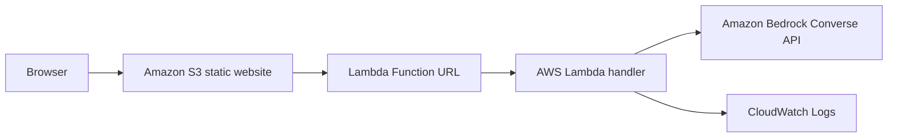
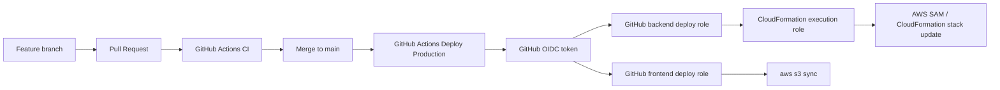
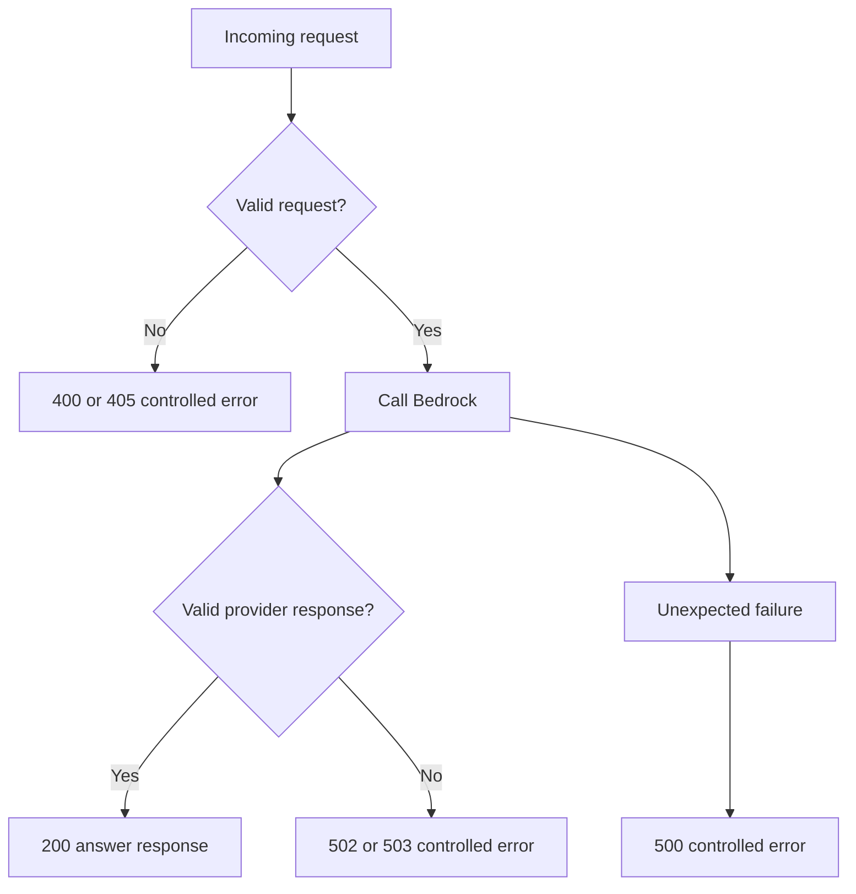

# Architecture

This document describes the deployed runtime architecture and the delivery architecture for `aws-cloud-ai-web`.

Status on July 16, 2026:

- The public website is deployed in Amazon S3
- The backend is deployed as an AWS Lambda Function URL
- The Lambda generates real answers through Amazon Bedrock
- CI is working on Pull Requests
- The latest merged production deployment workflow needs one follow-up fix from branch `docs/project-closure` before it can be considered fully reverified on `main`

## Runtime Architecture



### Runtime Components

`Browser`

- Loads static assets from the public S3 website endpoint
- Sends one JSON `POST` request per question
- Uses a 25-second timeout in the frontend

`Amazon S3 static website`

- Hosts `index.html`, `styles.css`, `app.js`, and `config.js`
- Is public-read by bucket policy
- Serves content over HTTP only in this phase

`Lambda Function URL`

- Public, unauthenticated entry point
- Accepts `POST`
- Enforces browser CORS at the Function URL layer

`AWS Lambda handler`

- Validates incoming JSON
- Rejects empty or oversized questions
- Calls a dedicated Bedrock helper module
- Translates known failures to controlled HTTP responses

`Amazon Bedrock`

- Called through `bedrock-runtime.converse`
- Uses the selected inference profile `eu.amazon.nova-micro-v1:0`
- Is authenticated only through the Lambda execution role

`CloudWatch Logs`

- Stores backend logs with 7-day retention
- Receives request lifecycle events, duration, request ID, and provider failure category

## Delivery Architecture



### Delivery Responsibilities

`CI`

- Runs on Pull Requests to `main`
- Does not request OIDC
- Does not deploy resources
- Runs formatting, linting, type checking, tests, `sam validate`, and `sam build`

`Deploy Production`

- Runs on push to `main`
- Requests OIDC
- Assumes the backend deployment role first
- Runs `sam deploy` against the existing stack
- Retrieves outputs and performs backend smoke checks
- Re-authenticates with the frontend deployment role
- Syncs static files to the frontend bucket

`GitHub backend deploy role`

- Can orchestrate stack deployment
- Can upload artifacts to the SAM bucket
- Can pass only the CloudFormation execution role
- Cannot deploy frontend files directly

`CloudFormation execution role`

- Applies stack changes with project-scoped permissions
- Can manage the Lambda, Function URL, log group, frontend bucket infrastructure, and Lambda execution role
- Cannot modify the GitHub OIDC provider or the GitHub deployment roles

`GitHub frontend deploy role`

- Can list, upload, and delete objects in the frontend bucket
- Cannot change the backend stack

## Backend Design

Source layout:

```text
backend/
├── bedrock_client.py
├── handler.py
├── responses.py
├── validation.py
└── __init__.py
```

Design split:

- `handler.py` handles request parsing, validation, logging, and HTTP translation
- `bedrock_client.py` owns model settings, Converse request assembly, provider error mapping, and response extraction
- `validation.py` enforces the public request rules
- `responses.py` keeps the Lambda output format consistent

## API Contract

Request:

```json
{
  "question": "What is AWS Lambda?"
}
```

Successful response:

```json
{
  "answer": "..."
}
```

Error response:

```json
{
  "error": {
    "code": "LLM_ERROR",
    "message": "No se ha podido generar una respuesta."
  }
}
```

Detailed reference: [api.md](api.md)

## Timeout Behavior

- Lambda timeout: `20` seconds
- Frontend timeout: `25` seconds

This keeps the browser timeout slightly above the Lambda timeout and avoids the browser failing first during normal Bedrock latency.

Observed Bedrock example on July 16, 2026:

- One manual `POST` completed in about `2777 ms` according to CloudWatch logs

## Error Flow



Public behavior stays intentionally simple:

- `400` for invalid input
- `405` for wrong method
- `502` for provider failure or malformed provider response
- `503` for temporary unavailability such as throttling
- `500` for unexpected internal failure

## Security Boundaries

- The frontend contains no secret keys
- The backend does not expose raw Bedrock or AWS exception payloads
- The Lambda execution role authenticates to Bedrock through IAM
- GitHub Actions uses OIDC instead of stored AWS access keys
- The public frontend and public Function URL are deliberate educational trade-offs, not production-grade security

## Known Limitations

- S3 static website hosting is HTTP only
- Function URL uses `AuthType: NONE`
- There is no WAF, authentication, rate limiting, or abuse control
- There is no database or conversation state
- There is no automated rollback beyond normal CloudFormation rollback behavior
